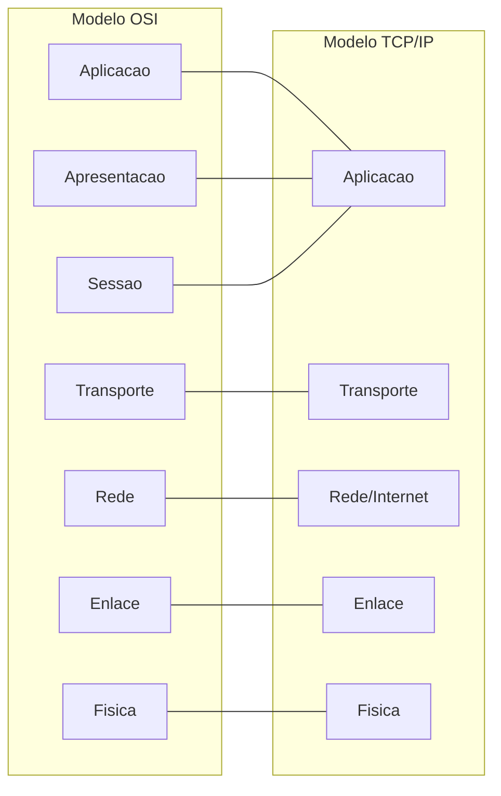
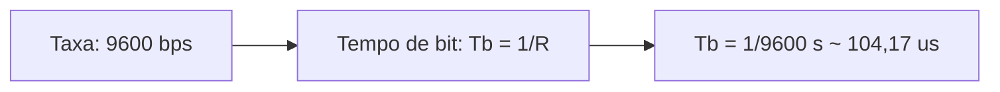

## 📅 Avaliação 1 (22/04/2024)

### Questão 1 — Conceito de Rede e 5 Elementos da Comunicação
> Descreva qual o conceito de uma rede de computadores, bem como os 5 elementos que compõem um sistema de comunicação.

| Aspecto                 | Conteúdo                                                                                                                                                                                                                                      |
| ----------------------- | --------------------------------------------------------------------------------------------------------------------------------------------------------------------------------------------------------------------------------------------- |
| **📖 Resposta Ideal**    | Uma rede de computadores é um conjunto de dispositivos autônomos interconectados capazes de trocar informações e compartilhar recursos. Os 5 elementos são: **Emissor**, **Receptor**, **Mensagem**, **Meio de Transmissão** e **Protocolo**. |
| **✍️ Resposta do Aluno** | "Rede de computadores é um conjunto de computadores autônomos interconectados. Os 5 elementos são: Emissor, Receptor, mensagem, meio de transmissão e código/protocolo."                                                                      |
| **📝 Avaliação**         | A resposta do aluno está perfeitamente alinhada com a definição clássica (Kurose/Tanenbaum).                                                                                                                                                  |
| **💡 Explicação**        | Esta questão verifica a base da comunicação em redes: quem envia, quem recebe, o que é enviado, por onde trafega e sob quais regras. Sem esses 5 elementos, não existe comunicação de dados estruturada.                                      |

---

### Questão 2 — Abrangência Geográfica de Redes (WPAN, WLAN, WMAN, WWAN)
> No contexto da abrangência geográfica de redes de computadores, explique o que são e dê um exemplo de tecnologia para WPANs, WLANs, WMANs e WWANs.

| Aspecto                 | Conteúdo                                                                                                                                                                                                                                                                                                                                               |
| ----------------------- | ------------------------------------------------------------------------------------------------------------------------------------------------------------------------------------------------------------------------------------------------------------------------------------------------------------------------------------------------------ |
| **📖 Resposta Ideal**    | **WPAN**: alcance de poucos metros, exemplo Bluetooth. **WLAN**: alcance local (ambiente interno/prédio/campus), exemplo Wi-Fi. **WMAN**: alcance metropolitano (cidade), exemplo WiMAX/rede metropolitana. **WWAN**: grande alcance (regional/nacional/continental), exemplo redes celulares (3G/4G/5G).                                              |
| **✍️ Resposta do Aluno** | "WPAN - metros (Bluetooth). WLAN - Prédio/Campus (Wi-Fi). WMAN - Cidade (Sistema governamental). WWAN - Países/Continentes (3G/4G)."                                                                                                                                                                                                                   |
| **📝 Avaliação**         | O conceito de WMAN ficou levemente vago ("sistema governamental"), mas a classificação por alcance geográfico está correta. Resposta boa no geral.                                                                                                                                                                                                     |
| **💡 Explicação**        | O foco é relacionar tecnologia com alcance geográfico: **WPAN** (~10 m) para uso pessoal, **WLAN** (~100 m) para rede local sem fio, **WMAN** (~dezenas de km) para abrangência de cidade e **WWAN** (~centenas/milhares de km) para cobertura ampla via redes celulares. A chave é não confundir tipo de rede (abrangência) com aplicação específica. |

### Questão 3 — Modelos de Comunicação Cliente/Servidor e Publicação/Assinatura
> Explique o funcionamento (fluxo de comunicação) dos modelos de comunicação cliente/servidor e publicação/assinatura.

| Aspecto                 | Conteúdo                                                                                                                                                                                                                                                                                                         |
| ----------------------- | ---------------------------------------------------------------------------------------------------------------------------------------------------------------------------------------------------------------------------------------------------------------------------------------------------------------- |
| **📖 Resposta Ideal**    | Cliente/Servidor: Centralizado. O cliente solicita recursos e o servidor processa e responde. Publish/Subscribe: Baseado em eventos e intermediado por um *Broker*. Publicadores enviam mensagens para tópicos, e assinantes recebem mensagens dos tópicos nos quais se inscreveram. É assíncrono e desacoplado. |
| **✍️ Resposta do Aluno** | "Cliente/Servidor: O cliente consome o serviço do servidor. Pub/Sub: O publicador manda a mensagem para o broker que distribui para os assinantes interessados no tópico. O broker é o ponto central."                                                                                                           |
| **📝 Avaliação**         | Corretíssima e bem articulada. Pontuou que o broker é um ponto único de falha.                                                                                                                                                                                                                                   |
| **💡 Explicação**        | Em Cliente/Servidor, a comunicação é direta por requisição e resposta. Em Pub/Sub, o broker desacopla emissor e receptor, permitindo troca assíncrona por tópicos.                                                                                                                                               |

### Questão 4 — Modelo OSI e TCP/IP
> O modelo de referência ISO/OSI e a pilha TCP/IP são organizados em 7 e 5 camadas, respectivamente. Cite, apresente graficamente a ordem hierárquica e descreva brevemente a responsabilidade de cada uma destas camadas.

| Aspecto                 | Conteúdo                                                                                                                                                                                                                                                                                                                                                                                                                                                                                                                                                                                                                                                                                                                                       |
| ----------------------- | ---------------------------------------------------------------------------------------------------------------------------------------------------------------------------------------------------------------------------------------------------------------------------------------------------------------------------------------------------------------------------------------------------------------------------------------------------------------------------------------------------------------------------------------------------------------------------------------------------------------------------------------------------------------------------------------------------------------------------------------------- |
| **📖 Resposta Ideal**    | OSI (Aplicação, Apresentação, Sessão, Transporte, Rede, Enlace, Física). TCP/IP (Aplicação, Transporte, Rede/Internet, Enlace, Física).                                                                                                                                                                                                                                                                                                                                                                                                                                                                                                                                                                                                        |
| **✍️ Resposta do Aluno** | "(Desenhou as duas pilhas). Camada 1: Bits/Física. Camada 2: Enlace/Endereçamento Lógico. Camada 3: Rede/IP. Camada 4: Transporte/Segmentos."                                                                                                                                                                                                                                                                                                                                                                                                                                                                                                                                                                                                  |
| **📝 Avaliação**         | Boa, com ressalvas. Na L2 (Enlace), o aluno citou "endereçamento lógico". Endereçamento lógico (IP) é responsabilidade da camada de Rede (L3). A camada de Enlace lida com endereçamento físico (MAC).                                                                                                                                                                                                                                                                                                                                                                                                                                                                                                                                         |
| **💡 Explicação**        | A intenção é separar responsabilidades por camada — pense em um prédio de apartamentos: - **L7–L5 (Aplicação, Apresentação, Sessão):** o morador dentro do apartamento (interface com o usuário, formatação, sessão). - **L4 (Transporte):** o elevador (garante que os dados cheguem inteiros e na ordem certa — TCP ou UDP). - **L3 (Rede):** a portaria com endereço lógico — decide qual prédio/bloco (roteamento por IP). - **L2 (Enlace):** o corredor do andar com endereço físico (MAC) — entrega na porta certa dentro do mesmo andar. - **L1 (Física):** os fios e cabos da infraestrutura do prédio (bits, voltagem, sinais elétricos).  Confundir MAC (L2) com IP (L3) é um dos erros mais cobrados em prova. |

### Questão 5 — Mecanismos FDM, WDM e TDM
> Descreva os mecanismos FDM, WDM e TDM.

| Aspecto                 | Conteúdo                                                                                                                                                                                                                                                                   |
| ----------------------- | -------------------------------------------------------------------------------------------------------------------------------------------------------------------------------------------------------------------------------------------------------------------------- |
| **📖 Resposta Ideal**    | FDM (Multiplexação por Divisão de Frequência) divide a banda do canal em várias frequências. WDM (Comprimento de Onda) é o equivalente óptico, dividindo a luz em diferentes cores. TDM (Tempo) divide o uso do canal em fatias de tempo exclusivas para cada transmissor. |
| **✍️ Resposta do Aluno** | "FDM: Multiplexação analógica por frequência. WDM: Multiplexação analógica por comprimento de onda. TDM: Multiplexação digital por tempo."                                                                                                                                 |
| **📝 Avaliação**         | Correto e conciso.                                                                                                                                                                                                                                                         |
| **💡 Explicação**        | As três técnicas existem para compartilhar o mesmo meio físico com múltiplos fluxos: por faixas de frequência, por comprimentos de onda na fibra e por intervalos de tempo.                                                                                                |

### Questão 6 — Elementos Ativos de Rede
> Cite e descreva 6 elementos ativos de rede.

| Aspecto                 | Conteúdo                                                                                                                                                             |
| ----------------------- | -------------------------------------------------------------------------------------------------------------------------------------------------------------------- |
| **📖 Resposta Ideal**    | Roteador, Switch, Hub, Access Point (AP), Repetidor, Firewall.                                                                                                       |
| **✍️ Resposta do Aluno** | "Hub: (transmite pra todos, em desuso). Switch: (transmite para o destino certo). Roteador: (conecta redes diferentes)."                                             |
| **📝 Avaliação**         | Incompleta. O aluno acertou as descrições dos três que lembrou (incluindo o fato do Hub estar em desuso), mas faltaram outros três para a pontuação cheia.           |
| **💡 Explicação**        | A pergunta mede repertório técnico de equipamentos ativos e suas funções. O erro mais comum é acertar os conceitos, mas listar menos itens do que o enunciado exige. |

### Questão 7 — NBR 14.565 (Cabeamento Estruturado)
> No Brasil, os sistemas de cabeamento estruturados prediais são definidos pela norma NBR 14.565. Neste contexto, cite e descreva ao menos 6 elementos que compõe esta norma.

| Aspecto                 | Conteúdo                                                                                                                                                             |
| ----------------------- | -------------------------------------------------------------------------------------------------------------------------------------------------------------------- |
| **📖 Resposta Ideal**    | Sala de Equipamentos (ER), Sala de Telecomunicações (TR), Cabeamento Backbone (Vertical), Cabeamento Horizontal, Área de Trabalho (WA), Entrada de Facilidades (EF). |
| **✍️ Resposta do Aluno** | "Não lembrei."                                                                                                                                                       |
| **📝 Avaliação**         | Questão deixada em branco.                                                                                                                                           |
| **💡 Explicação**        | A NBR 14565 organiza o cabeamento predial em ambientes e segmentos padronizados. Saber os nomes e a função de cada elemento garante pontuação integral.              |

### Questão 8 — Código de Hamming
> Uma das funcionalidades da camada de enlace é a detecção de erros... descreva o funcionamento do mecanismo baseado no código de Hamming.

| Aspecto                 | Conteúdo                                                                                                                                                                    |
| ----------------------- | --------------------------------------------------------------------------------------------------------------------------------------------------------------------------- |
| **📖 Resposta Ideal**    | Utiliza bits de paridade inseridos em posições de potência de 2 dentro do bloco de dados para não apenas detectar, mas também localizar e corrigir erros de um único bit.   |
| **✍️ Resposta do Aluno** | "Utiliza bits de paridade para detectar e corrigir o erro. Usa a fórmula $2^m \ge m + M + 1$."                                                                              |
| **📝 Avaliação**         | Excelente. A inclusão da inequação matemática demonstra domínio do assunto.                                                                                                 |
| **💡 Explicação**        | O código de Hamming não só detecta erro, ele aponta a posição do bit incorreto e permite correção de erro simples, o que o torna muito relevante para confiabilidade em L2. |
