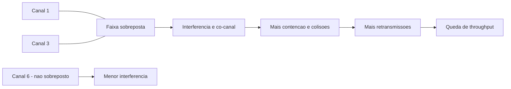
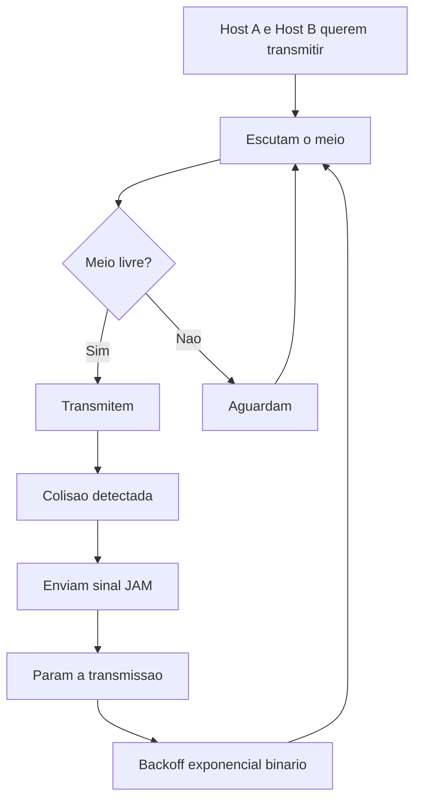
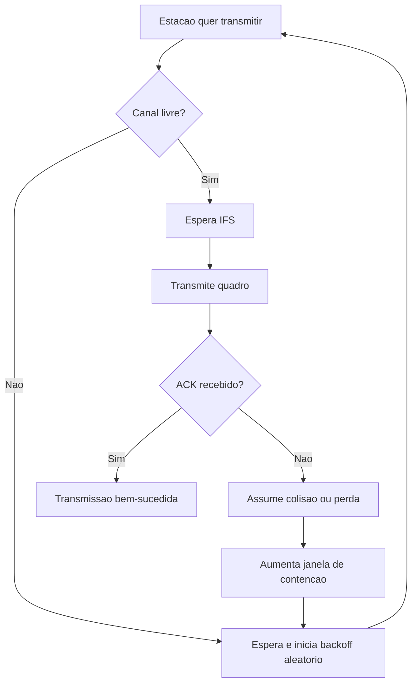

# Avaliação 1 — 16/04/2026

> IFSC — Curso: Ciência da Computação — Disciplina: Redes de Computadores I (RCA) — Professor: Robson Costa — Fase: 3ª — Ano/Semestre: 2026/1 — Data: 16/04/2026.
>
> Questões 1 a 7 são de somatória (01, 02, 04, 08 e 16). Questões 8, 9 e 10 são discursivas.

## Questão 1 — Conceitos de Rede e Estrutura Básica

> Conceitos básicos de rede e classificação tecnológica.

**Alternativas**
01. [✔] uma rede de computadores pode ser conceituada como um conjunto de computadores autônomos interconectados.
02. [✔] a estrutura básica de uma rede de computadores é composta por um ou mais hosts e um sistema de interconexão entre os mesmos.
04. [✔] o compartilhamento de recursos de um único computador através de terminais remotos somente foi possível após a implementação das técnicas de *time-sharing* por sistemas operacionais.
08. [✔] o Ethernet é considerado um exemplo de tecnologia LAN (*Local Area Network*).
16. [✘] o Bluetooth é considerado um exemplo de tecnologia WLAN (*Wireless Local Area Network*).

**Explicação das alternativas incorretas**
- 16. Incorreta: Bluetooth é classificado como **WPAN** (rede pessoal), enquanto **WLAN** corresponde a redes locais sem fio, como Wi-Fi.

**Soma (texto)**
Itens corretos: 01, 02, 04 e 08. Soma final: 15.

**Soma (KaTeX)**
$$
S = 1 + 2 + 4 + 8 = 15
$$

---

## Questão 2 — Modelos de Comunicação

> Modelos Cliente/Servidor, P2P e Publicação/Assinatura.

**Alternativas**
01. [✘] os modelos de comunicação cliente/servidor e publicação/assinatura são fortemente dependentes dos protocolos utilizados da camada L2, ou seja, a depender o protocolo selecionado na L2 eles não são passíveis de serem implementados.
02. [✔] embora o modelo de comunicação Par-a-Par (P2P) seja simples de se implementar uma de suas principais desvantagens é o seu controle de acesso.
04. [✔] o modelo de comunicação cliente/servidor, amplamente utilizado em serviços de rede na Internet, exige um nível mínimo de sincronia entre os pares comunicantes para que a transmissão de mensagens seja realizada com sucesso.
08. [✔] o modelo de comunicação publicação/assinatura utiliza um elemento central chamado *broker*, que ao tempo gera uma vantagem por permitir comunicação fracamente acoplada entre emissor e receptor gera também uma desvantagem por ser um ponto único de falha.
16. [✔] o modelo de comunicação publicação/assinatura na camada L5 opera de forma similar ao que o *multicast* realiza na camada L3.

**Explicação das alternativas incorretas**
- 01. Incorreta: Os modelos de comunicação C/S e Pub/Sub são paradigmas de arquitetura de software que podem ser implementados sobre qualquer protocolo de transporte (TCP, UDP, etc.), não são restritos a protocolos específicos da camada L2.

**Soma (texto)**
Itens corretos: 02, 04, 08 e 16. Soma final: 30.

**Soma (KaTeX)**
$$
S = 2 + 4 + 8 + 16 = 30
$$

---

## Questão 3 — CDN, VPN e Arquiteturas de Rede

> Conceitos de distribuição de conteúdo, tunelamento e fundamentos de comunicação.

**Alternativas**
01. [✔] o processo de comunicação exige a existência de 5 (cinco) elementos básicos, sendo eles o emissor, o receptor, a mensagem, o canal de transmissão e o protocolo de comunicação.
02. [✘] uma CDN (*Content Delivery Network*) é uma rede com a finalidade de distribuir conteúdos a partir de computadores pessoais distribuídos geograficamente.
04. [✔] uma VPN (*Virtual Private Network*) cria um canal criptografado entre dois hosts em uma rede pública.
08. [✘] o *switch* é um equipamento de rede ativo que conecta diferentes dispositivos em uma topologia em barramento.
16. [✔] as camadas de uma arquitetura de rede definem um conjunto específico e inconfundível de regras que permitem a comunicação por dispositivos de diferentes fabricantes.

**Explicação das alternativas incorretas**
- 02. Incorreta: CDN (Content Delivery Network) distribui conteúdo a partir de servidores/datacenters e caches geograficamente distribuídos, não de computadores pessoais.
- 08. Incorreta: Switch é um equipamento que opera em topologia em estrela (comum em redes modernas), não em barramento. A topologia em barramento é característica de hubs ou cabos coaxiais antigos.

**Soma (texto)**
Itens corretos: 01, 04 e 16. Soma final: 21.

**Soma (KaTeX)**
$$
S = 1 + 4 + 16 = 21
$$

---

## Questão 4 — Camada Física e Modelos

> RM-OSI, TCP/IP, ruído e tempo de bit.

**Alternativas**
01. [✔] a arquitetura RM-OSI possui as camadas de sessão e apresentação a mais quando comparada com a arquitetura TCP/IP.
02. [✔] a atenuação, a distorção e o ruído são as principais causas de perdas de dados em sinais de comunicação.
04. [✔] cabos de fibra óptica utilizam comumente multiplexação por divisão de frequência.
08. [✔] ao utilizarmos um sistema de comunicação que transmita dados em uma taxa fixa de 9600 bps podemos afirmar que o tempo de bit é de aproximadamente 104μs.
16. [✘] a NBR 14.565 define a padronização de cabeamento estruturado residencial.

**Explicação das alternativas incorretas**
- 16. Incorreta: A NBR 14.565 é uma norma para cabeamento estruturado **predial e comercial**, não especificamente residencial. Ela define padrões para edifícios comerciais e industriais.

**Soma (texto)**
Itens corretos: 01, 02, 04 e 08. Soma final: 15.

**Soma (KaTeX)**
$$
S = 1 + 2 + 4 + 8 = 15
$$

---

## Questão 5 — Camada de Enlace e CRC

> Enquadramento, endereçamento e detecção de erros na L2.

**Alternativas**
01. [✔] o enquadramento de *frames* da camada L2 pode ser realizado de forma fixa ou variável.
02. [✔] endereçamentos *unicast*, *broadcast* e *multicast* podem ser definidos na L2 e na L3.
04. [✘] a técnica de paridade em bloco consegue detectar erros em no máximo 2 bits de dados.
08. [✘] ao utilizar a técnica de paridade *checksum*, um *host* que receba a sequência de bits 0101 0000 0110 irá considerar que a mensagem foi recebida sem erros.
16. [✔] ao utilizar a técnica de paridade CRC com o polinômio gerador x² + 1, um *host* que deseje transmitir a sequência de bit úteis 110010 irá efetivamente transmitir a sequência 11001001.

**Explicação das alternativas incorretas**
- 04. Incorreta: A técnica de paridade em bloco não tem como limitação detectar "no máximo 2 bits". Dependendo da implementação e do padrão de erro, pode detectar múltiplos bits errados.
- 08. Incorreta: Checksum é tipicamente usado nas camadas L3/L4. Na camada L2 (Enlace de Dados), a técnica padrão para detecção de erros é o CRC (Cyclic Redundancy Check).

**Soma (texto)**
Itens corretos: 01, 02 e 16. Soma final: 19.

**Soma (KaTeX)**
$$
S = 1 + 2 + 16 = 19
$$

---

## Questão 6 — ARQ e Piggybacking

> Controle de fluxo/erros com Stop-and-Wait e uso de ACK.

**Alternativas**
01. [✔] a técnica de paridade que utiliza o Código de *Hamming* permite que além de detectar a existência de um erro seja possível identificar quais bits possuem esse erro, possibilitando assim a correção do mesmo sem a necessidade de uma retransmissão por parte do emissor da mensagem.
02. [✘] a técnica de controle de fluxo *Stop-and-Wait* utiliza o pacote *acknowledgement* (ACK) para que o emissor possa sinalizar ao receptor o sucesso da recepção de dados.
04. [✘] a técnica *piggybacking* permite que em um fluxo unidirecional, os pacotes de confirmação (ACK) peguem carona em pacotes de dados.
08. [✔] para permitir o funcionamento da técnica de controle de erros *Stop-and-Wait ARQ* é necessária a utilização de um temporizador para a contagem de *timeout* e do pacote de confirmação ACK.
16. [✔] a técnica de controle de erros *Stop-and-Wait ARQ* somente permite a transmissão de uma nova mensagem pelo emissor após o recebimento do pacote de confirmação ACK ou *timeout* da mensagem anterior.

**Explicação das alternativas incorretas**
- 02. Incorreta: No mecanismo de ACK (Acknowledgement), quem sinaliza o sucesso da recepção ao emissor é o **receptor**, não o emissor. O ACK é uma confirmação enviada de volta ao emissor.
- 04. Incorreta: O piggybacking exige um fluxo **bidirecional**. O ACK "pega carona" nos dados que estão voltando para o emissor original. Sem tráfego nos dois sentidos, não há como fazer piggybacking.

**Soma (texto)**
Itens corretos: 01, 08 e 16. Soma final: 25.

**Soma (KaTeX)**
$$
S = 1 + 8 + 16 = 25
$$

---

## Questão 7 — CSMA/CA e CSMA/CD

> Acesso múltiplo em meios sem fio e cabeados.

**Alternativas**
01. [✔] o protocolo CSMA (*Carrier Sense Multiple Access*) permite que os hosts que desejem realizar uma transmissão escutem o meio por um determinado período de tempo a fim de evitarem sobreposição de sinal.
02. [✔] o protocolo CSMA/CA é utilizado no padrão IEEE 802.11 enquanto que o protocolo CSMA/CD é utilizado no padrão IEEE 802.3.
04. [✘] o protocolo CSMA/CA é mais eficiente do ponto de vista de retransmissão do que o protocolo CSMA/CD.
08. [✔] o problema da estação exposta em redes *wireless* pode ser resolvido com o uso de quadros especiais chamados RTS (*Request to Send*) e CTS (*Clear to Send*).
16. [✔] o problema da estação oculta em redes *wireless* gera atraso de comunicação em estações que não façam parte do fluxo lógico de comunicação corrente.

**Explicação das alternativas incorretas**
- 04. Incorreta: CSMA/CA (usado em Wi-Fi) e CSMA/CD (usado em Ethernet) atendem meios físicos completamente distintos (wireless vs cabeado). Não é correto afirmar que um é "mais eficiente" que o outro — cada um é otimizado para seu meio específico.

**Soma (texto)**
Itens corretos: 01, 02, 08 e 16. Soma final: 27.

**Soma (KaTeX)**
$$
S = 1 + 2 + 8 + 16 = 27
$$

---

## Questão 8 — Sobreposição de Sub-canais no IEEE 802.11

> Através de um desenho, explique detalhadamente o efeito da sobreposição de sub-canais de frequência no protocolo IEEE 802.11.

| Aspecto                 | Conteúdo                                                                                                                                                                                           |
| ----------------------- | -------------------------------------------------------------------------------------------------------------------------------------------------------------------------------------------------- |
| **📖 Resposta Ideal**    | Canais sobrepostos compartilham parte do espectro, elevam interferência e contenção no meio. Com mais espera e retransmissão, o throughput efetivo cai.                                            |
| **✍️ Resposta da Aluna** | Sem resposta visível nas imagens enviadas.                                                                                                                                                         |
| **📝 Avaliação**         | Não avaliável com as fotos atuais (não há desenho/resolução da resposta).                                                                                                                          |
| **💡 Explicação**        | Em 2,4 GHz, o planejamento clássico usa canais não sobrepostos (ex.: 1, 6 e 11) para reduzir interferência e co-canal. Canais adjacentes compartilham espectro, causando degradação de desempenho. |

---

## Questão 9 — CSMA/CD em Colisão

> Através de um desenho, explique o funcionamento do protocolo CSMA/CD (IEEE 802.3) na ocorrência de uma colisão.

| Aspecto                 | Conteúdo                                                                                                                                                                                                                   |
| ----------------------- | -------------------------------------------------------------------------------------------------------------------------------------------------------------------------------------------------------------------------- |
| **📖 Resposta Ideal**    | No CSMA/CD, o host escuta o meio, transmite se livre, detecta colisão durante o envio, envia JAM, interrompe e aplica backoff antes de tentar de novo.                                                                     |
| **✍️ Resposta da Aluna** | Sem resposta visível nas imagens enviadas.                                                                                                                                                                                 |
| **📝 Avaliação**         | Não avaliável com as fotos atuais (não há desenho/resolução da resposta).                                                                                                                                                  |
| **💡 Explicação**        | O mecanismo é típico de Ethernet half-duplex e usa detecção de colisão em tempo real durante a transmissão. Quando há colisão, o sinal JAM é enviado e o backoff exponencial binário é aplicado antes de tentar novamente. |

---

## Questão 10 — CSMA/CA em Colisão

> Através de um desenho, explique o funcionamento do protocolo CSMA/CA (IEEE 802.11) na ocorrência de uma colisão.

| Aspecto                 | Conteúdo                                                                                                                                                                                                                              |
| ----------------------- | ------------------------------------------------------------------------------------------------------------------------------------------------------------------------------------------------------------------------------------- |
| **📖 Resposta Ideal**    | No CSMA/CA, a estação escuta, espera IFS, aplica backoff aleatório e transmite. Se não receba ACK, assume colisão/perda, aumenta contenção e retransmite.                                                                             |
| **✍️ Resposta da Aluna** | Sem resposta visível nas imagens enviadas.                                                                                                                                                                                            |
| **📝 Avaliação**         | Não avaliável com as fotos atuais (não há desenho/resolução da resposta).                                                                                                                                                             |
| **💡 Explicação**        | Em Wi-Fi não há detecção de colisão em tempo real durante a transmissão; a confirmação de entrega bem-sucedida é inferida pela recepção do ACK. Sem ACK, a estação assume que houve colisão ou perda e aumenta a janela de contenção. |

**Cartão Resposta (foto):** sem marcações visíveis nas questões 1 a 7; questões 8, 9 e 10 aparecem com traços por serem discursivas.
