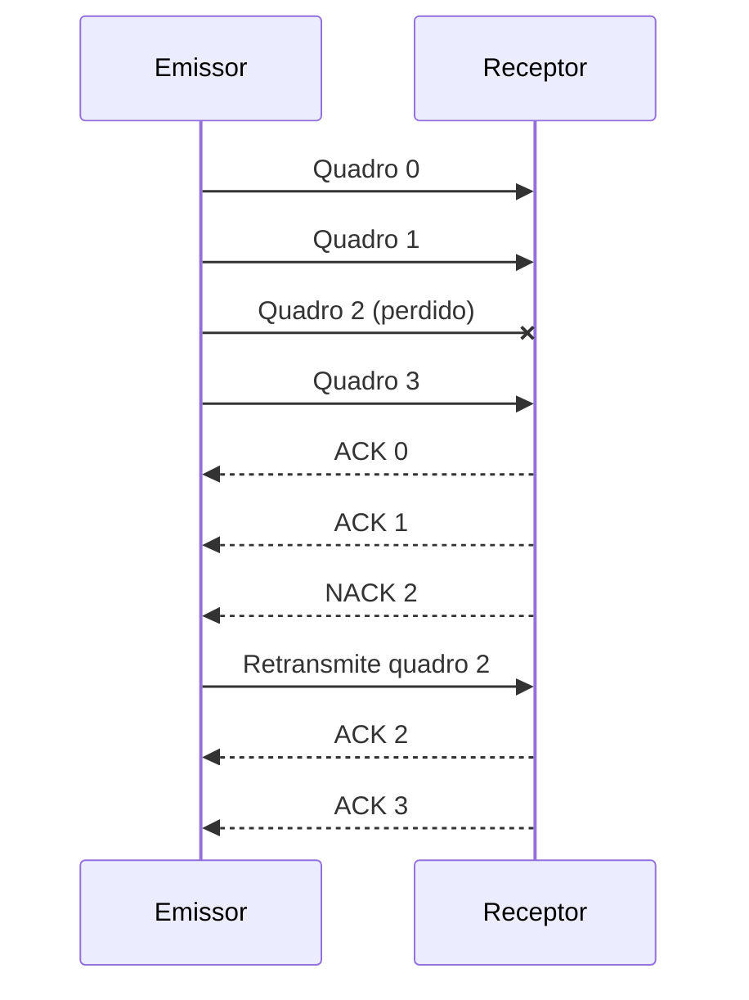
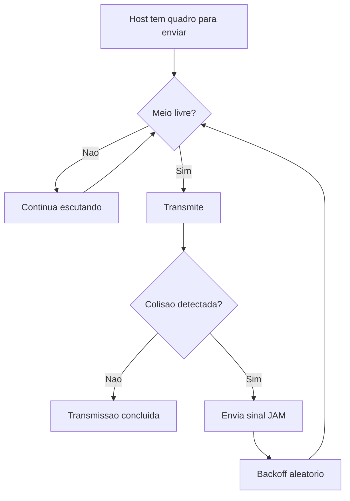

# Recuperação 1 — 29/04/2024

## Questão 1 — Modelos de Comunicação (C/S, P2P, Pub/Sub)

> Explique o funcionamento e apresente vantagens e desvantagens dos modelos de comunicação cliente/servidor, par-a-par (peer-to-peer) e publicação/assinatura.

| Aspecto                 | Conteúdo                                                                                                                                                                                                                                                         |
| ----------------------- | ---------------------------------------------------------------------------------------------------------------------------------------------------------------------------------------------------------------------------------------------------------------- |
| **📖 Resposta Ideal**    | (C/S já abordado). P2P: Dispositivos atuam como clientes e servidores simultaneamente; é altamente escalável, mas difícil de gerenciar.                                                                                                                          |
| **✍️ Resposta do Aluno** | "P2P: Todos são clientes e servidores ao mesmo tempo. Não possui escalabilidade. C/S: Um servidor central. Pub/Sub: Usa broker e tópicos."                                                                                                                       |
| **📝 Avaliação**         | Boa, mas com falha conceitual grave no P2P. Errou ao afirmar que "não possui escalabilidade". Na verdade, a grande vantagem do P2P (como no BitTorrent) é justamente a altíssima escalabilidade. A análise dos outros modelos (C/S e Pub/Sub) foi bem executada. |
| **💡 Explicação**        | A comparação entre arquiteturas deve considerar escalabilidade, acoplamento e gestão. P2P tende a escalar bem, C/S centraliza controle e Pub/Sub desacopla via broker.                                                                                           |

---

## Questão 2 — OSI e TCP/IP (Revisão)

> O modelo de referência ISO/OSI e a pilha TCP/IP... (Mesma pergunta da Prova 1).

| Aspecto                 | Conteúdo                                                                                                                                                                 |
| ----------------------- | ------------------------------------------------------------------------------------------------------------------------------------------------------------------------ |
| **📖 Resposta Ideal**    | OSI (Aplicação, Apresentação, Sessão, Transporte, Rede, Enlace, Física). TCP/IP (Aplicação, Transporte, Rede/Internet, Enlace, Física).                                  |
| **✍️ Resposta do Aluno** | (Refez o desenho. Desta vez, corrigiu os conceitos de Enlace e Rede. Descreveu L2 como controle de fluxo, detecção de erros e MAC, e L3 como endereçamento lógico (IP).) |
| **📝 Avaliação**         | Excelente evolução. O aluno corrigiu os erros cometidos na primeira prova e entregou uma descrição muito mais madura das camadas.                                        |
| **💡 Explicação**        | O objetivo é consolidar o mapeamento correto das funções por camada. Diferenciar MAC (L2) de IP (L3) evita os erros conceituais mais frequentes.                         |

---

## Questão 3 — Encapsulamento e Desencapsulamento

> Explique o conceito de encapsulamento e desencapsulamento em arquiteturas de redes... bem como explique os 3 elementos básicos.

| Aspecto                 | Conteúdo                                                                                                                                                                                                                                                                           |
| ----------------------- | ---------------------------------------------------------------------------------------------------------------------------------------------------------------------------------------------------------------------------------------------------------------------------------- |
| **📖 Resposta Ideal**    | Encapsular é adicionar cabeçalhos (headers) com informações de controle ao descer nas camadas da pilha. Desencapsular é retirar esses cabeçalhos na recepção ao subir as camadas. Os 3 elementos são: Camadas, Interfaces e Protocolos.                                            |
| **✍️ Resposta do Aluno** | "Encapsulamento é quando o sinal é transformado para ser enviado (ex: cabo de fibra ótica). Desencapsulamento é quando ele sai do meio físico."                                                                                                                                    |
| **📝 Avaliação**         | Erro conceitual grave. Confundiu o conceito de protocolo com meio físico. Misturou propagação física guiada/não guiada com o conceito lógico de formação de PDUs (Protocol Data Units). Na sequência (imagem 8), acertou os 3 elementos básicos (Camadas, Interfaces, Protocolos). |
| **💡 Explicação**        | Encapsulamento e desencapsulamento são processos lógicos de adição e remoção de cabeçalhos nas camadas, não processos físicos de transmissão no meio.                                                                                                                              |

---

## Questão 4 — Ruído e os 4 Tipos

> Explique o conceito de ruído em um sinal de redes de computadores bem como cite e explique os 4 tipos.

| Aspecto                 | Conteúdo                                                                                                                                                                                                                   |
| ----------------------- | -------------------------------------------------------------------------------------------------------------------------------------------------------------------------------------------------------------------------- |
| **📖 Resposta Ideal**    | Energia indesejada que se soma ao sinal original, degradando-o. Tipos: Térmico (agitação de elétrons), Intermodulação, Diafonia/Crosstalk (interferência entre fios próximos) e Impulsivo (picos irregulares, como raios). |
| **✍️ Resposta do Aluno** | (Definiu corretamente como interferência. Citou Indução (motores), Térmica (elétrons), Faixa cruzada/Crosstalk (cabos próximos) e Impulso (raio).)                                                                         |
| **📝 Avaliação**         | Ótima resposta. "Indução" é um termo válido para ruído eletromagnético induzido externamente.                                                                                                                              |
| **💡 Explicação**        | A questão avalia a origem física das distorções de sinal e seu impacto na qualidade da comunicação. Identificar o tipo de ruído ajuda na mitigação correta.                                                                |

---

## Questão 5 — Tempo de Bit (9600bps)

> Assuma um sistema de comunicação com um baudrate de 9600bps. Qual o tempo de bit?

| Aspecto                 | Conteúdo                                                                                                                       |
| ----------------------- | ------------------------------------------------------------------------------------------------------------------------------ |
| **📖 Resposta Ideal**    | O tempo de bit é o inverso da taxa de transmissão ($1 / Taxa$). Portanto, $1 / 9600$ segundos.                                 |
| **✍️ Resposta do Aluno** | (Exibiu o desenho do clock, armou o cálculo matemático e chegou na fração exata de $\frac{1}{9600}$.)                          |
| **📝 Avaliação**         | Correto. Demonstrou entender a relação matemática entre frequência/taxa e período.                                             |
| **💡 Explicação**        | Tempo de bit é uma relação direta entre taxa e período: quanto maior a taxa, menor o tempo de cada bit no meio de transmissão. |

---

## Questão 6 — CRC (Validação de Mensagem)

> Assuma que uma estação realiza detecção de erros (CRC) utilizando G(x) = CRC-2 ($x^2+1=101$). Receba a mensagem M'(x) = 11001000. Demonstre se é válida.

| Aspecto                 | Conteúdo                                                                                                                                                                              |
| ----------------------- | ------------------------------------------------------------------------------------------------------------------------------------------------------------------------------------- |
| **📖 Resposta Ideal**    | Deve-se realizar a divisão polinomial XOR de 11001000 por 101. Se o resto for 000, é válida. Se for diferente, ocorreu erro. Calculando, o resto é 001. Logo, a mensagem contém erro. |
| **✍️ Resposta do Aluno** | "(Realizou a conta de divisão XOR). Resto: 001. A mensagem não é válida."                                                                                                             |
| **📝 Avaliação**         | Impecável. A execução matemática binária foi perfeita.                                                                                                                                |
| **💡 Explicação**        | No CRC, o resto da divisão determina validade do quadro. Resto diferente de zero indica detecção de erro durante a transmissão.                                                       |

---

## Questão 7 — Piggybacking

> Explique e exemplifique o conceito de piggybacking.

| Aspecto                 | Conteúdo                                                                                                                                                                                          |
| ----------------------- | ------------------------------------------------------------------------------------------------------------------------------------------------------------------------------------------------- |
| **📖 Resposta Ideal**    | É a técnica de atrasar o envio de um pacote de confirmação (ACK) para enviá-lo embutido (no cabeçalho) junto com o próximo quadro de dados que estiver indo na mesma direção, economizando banda. |
| **✍️ Resposta do Aluno** | "Quando o ACK (confirmação) 'pega carona' em um pacote de dados que está indo para o mesmo destino."                                                                                              |
| **📝 Avaliação**         | Correta e direta. O uso de analogias como "pegar carona" é um excelente sinal de entendimento genuíno do conceito.                                                                                |
| **💡 Explicação**        | Piggybacking reduz overhead ao combinar controle e dados no mesmo quadro, melhorando eficiência quando há tráfego nos dois sentidos.                                                              |

---

## Questão 8 — Selective Repeat ARQ

> Explique e exemplifique o mecanismo de controle de erros da L2 Selective Repeat ARQ.

| Aspecto                 | Conteúdo                                                                                                                                                                                                                                                                       |
| ----------------------- | ------------------------------------------------------------------------------------------------------------------------------------------------------------------------------------------------------------------------------------------------------------------------------ |
| **📖 Resposta Ideal**    | Em contraste com o Go-Back-N (que reenvia todo o pacote a partir do erro), o Selective Repeat utiliza ACKs e NACKs individuais. Se um quadro se perde, o receptor solicita apenas aquele quadro perdido, e o emissor o retransmite isoladamente, não afetando os subsequentes. |
| **✍️ Resposta do Aluno** | "Utiliza janelas e retransmite somente os quadros que apresentaram defeito ou não chegaram, diferente do Go-Back-N."                                                                                                                                                           |
| **📝 Avaliação**         | Excelente nível de detalhamento. Pontuou perfeitamente que o grande diferencial é retransmitir "somente os quadros com 'defeito'", diferenciando expressamente do Go Back 'N.                                                                                                  |
| **💡 Explicação**        | O ganho do Selective Repeat está na retransmissão seletiva: só o que faltou ou veio corrompido é reenviado, economizando banda e tempo.                                                                                                                                        |

---

## Questão 9 — CSMA/CD no Ethernet

> Descreva o funcionamento do CSMA/CD implementado no IEEE 802.3 (Ethernet).

| Aspecto                 | Conteúdo                                                                                                                                                                                                                                                                                           |
| ----------------------- | -------------------------------------------------------------------------------------------------------------------------------------------------------------------------------------------------------------------------------------------------------------------------------------------------- |
| **📖 Resposta Ideal**    | *Carrier Sense Multiple Access with Collision Detection*. Escuta o meio antes de enviar. Se houver colisão enquanto transmite os dados nos cabos, ele detecta, para de transmitir, envia um sinal de congestionamento (Jam) e espera um tempo aleatório (*Backoff*) antes de reiniciar o processo. |
| **✍️ Resposta do Aluno** | (Contrastou bem o uso de cabos no Ethernet (CSMA/CD) com o WiFi (CSMA/CA). Mencionou a detecção (listen) e o *Backoff* caso haja colisão. Fez diagramas ilustrativos.)                                                                                                                             |
| **📝 Avaliação**         | Muito boa. Cobriu todos os requisitos técnicos do protocolo.                                                                                                                                                                                                                                       |
| **💡 Explicação**        | O CSMA/CD funciona em redes cabeadas com detecção de colisão em tempo real. Ao detectar conflito, interrompe a transmissão e aplica recuo aleatório para reduzir novas colisões.                                                                                                                   |

