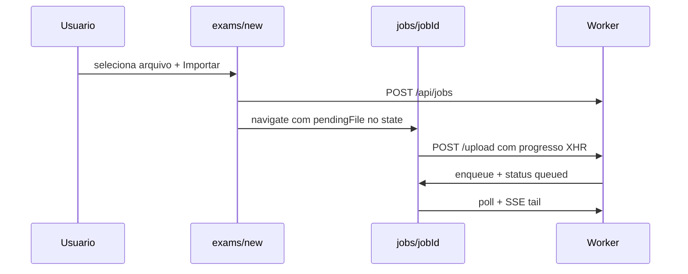

# Ingest em tempo real: upload unificado, eventos granulares e indicador global

> Convenções compartilhadas: `docs/context/CONVENTIONS.md`. Sync poll/SSE e rota `/jobs/$jobId`:
> SPEC-0014, SPEC-0018. Pipeline de ingest e data parts base: SPEC-0004. Orquestração:
> ADR-0009. Protocolo de mensagens: ADR-0008.

## Objetivo

Evoluir a experiência de upload e extração para um fluxo unificado estilo GitHub Actions:

1. Upload e monitoramento na mesma página `/jobs/$jobId` (sem redirect para `/exams/new` em
   `awaiting_upload`).
2. Eventos granulares no pipeline (texto system + progresso de persistência).
3. Tab **Eventos** agrupada por fase de ingest.
4. Indicador global de jobs ativos no header da shell.

## Fluxo



1. `/exams/new`: usuário escolhe arquivo → `POST /api/jobs` → `navigate` para `/jobs/$jobId` com
   `pendingFile` no router state.
2. `/jobs/$jobId`: se `status=awaiting_upload`, exibe painel de upload; auto-upload quando
   `pendingFile` presente; fallback file picker após refresh sem state.
3. Upload OK → job `queued`; `useJobMonitor` retoma poll + SSE (inalterado vs SPEC-0014).
4. Consumer emite eventos granulares (Fase 2); tab **Eventos** agrupa por fase (Fase 3).
5. Header exibe badge de jobs ativos com poll `GET /api/jobs/active` (Fase 4).

## Contrato

### Fase 1 — Upload unificado

#### Router state (congelado)

```ts
type JobUploadLocationState = { pendingFile?: File };
```

- `useIngestJob.createIngestJob()` navega com
  `navigate({ to: "/jobs/$jobId", params: { jobId }, state: { pendingFile: file } })`.
- `pendingFile` é **efêmero** (router state) — refresh sem state não restaura o `File`; nesse caso
  o painel de upload oferece file picker.

#### Componentes

| Componente | Path | Responsabilidade |
| ---------- | ---- | ---------------- |
| `IngestUploadPanel` | `src/features/background-processes/components/ingest-upload-panel.tsx` | File picker, barra de progresso XHR, estados `uploading` / `failed` / retry |
| `job-monitor-page.tsx` | `src/features/background-processes/pages/job-monitor-page.tsx` | Renderiza upload panel quando `awaiting_upload`; **sem** redirect para `/exams/new` |

#### Upload com progresso

```ts
uploadIngestJobFileWithProgress(
  jobId: string,
  file: File,
  onProgress: (percent: number) => void,
): Promise<void>;
```

- Implementação via `XMLHttpRequest` em `src/features/exams/lib/ingest-api.ts`.
- `POST /api/jobs/:id/upload` — contrato de upload inalterado (SPEC-0004).

#### Comportamento

| QUANDO | DEVE |
| ------ | ---- |
| `awaiting_upload` + `pendingFile` no mount | iniciar upload automaticamente |
| `awaiting_upload` + refresh sem `pendingFile` | exibir file picker no job page |
| upload falha | `Alert` destructive + botão retry |
| upload abortado (browser/fechar aba) | job permanece `awaiting_upload`; reenvio no mesmo `jobId` (SPEC-0004 §caso 13) |

---

### Fase 2 — Eventos granulares

#### Data part novo (congelado)

```ts
type IngestPersistProgressPart = {
  type: "data-ingest-persist-progress";
  data: { saved: number; total: number };
};
```

- Constante: `INGEST_DATA_PART.PERSIST_PROGRESS = "data-ingest-persist-progress"`.
- Builder: `buildIngestPersistProgressPart(saved, total)`.
- Emitido durante `persisting` via callback `onPersistProgress` — **não** substitui
  `data-ingest-summary` ao final.

#### Text events system — lista fechada (congelada)

Mensagens emitidas com `buildIngestTextPart(text)`; role na UI: **`system`** (via
`isPhaseStatusText` ou lista equivalente no client).

| ID | Template | QUANDO emitir |
| -- | -------- | ------------- |
| `phase_reading` | `Lendo o arquivo enviado…` | início `reading_file` (junto com `data-ingest-phase`) |
| `file_read` | `Arquivo lido: {n} caracteres` | após leitura OK; `{n}` = contagem de caracteres do texto (formatação pt-BR com separador de milhar `.`) |
| `phase_extracting` | `Extraindo questões com o modelo de IA…` | início `extracting` (junto com `data-ingest-phase`) |
| `llm_call` | `Chamando modelo para extração…` | imediatamente antes da primeira chamada LLM |
| `llm_retry` | `Tentativa {attempt}/{maxAttempts}…` | antes de cada retry; `attempt` ∈ `{2,…,maxAttempts}`; `maxAttempts = MAX_LLM_RETRIES + 1` (= 3) |
| `phase_persisting` | `Salvando questões no banco de dados…` | início `persisting` (junto com `data-ingest-phase`) |
| `persist_validating` | `Validando {total} questão(ões)…` | início da persistência; `{total}` = questões válidas a persistir neste batch |

**Proibido** inventar novas mensagens system fora desta lista na v1 desta spec.

#### Parts existentes (inalterados)

| Part | Uso |
| ---- | --- |
| `data-ingest-phase` | mudança de fase |
| `data-ingest-stream-progress` | partial `streamObject` |
| `data-ingest-skipped-duplicate` | skip na persistência |
| `data-ingest-summary` | resumo final |

#### Emissão por etapa do pipeline

| Etapa | Eventos |
| ----- | ------- |
| `read-file.ts` | `phase_reading`, `data-ingest-phase: reading_file`, `file_read` |
| `extract-questions.ts` | `phase_extracting`, `data-ingest-phase: extracting`, `llm_call`, `llm_retry` (se retry), `data-ingest-stream-progress` (partials) |
| `persist-questions.ts` | `phase_persisting`, `data-ingest-phase: persisting`, `persist_validating`, `data-ingest-persist-progress` (incremental), `data-ingest-skipped-duplicate`, `data-ingest-summary` |

---

### Fase 3 — UI agrupada por fase

#### Regra de agrupamento (congelada)

Função `groupEventsByPhase(events)` — entrada: eventos ordenados por `seq` ascendente.

1. Manter `currentPhase: IngestPhase | null`, inicialmente `null`.
2. Para cada evento, ao encontrar `data-ingest-phase`, atualizar `currentPhase = data.phase`.
3. Grupo do evento:
   - Se `currentPhase === null` **no momento do evento** (ainda não houve `data-ingest-phase`
     anterior) → grupo **`"Inicialização"`**.
   - Caso contrário → label do grupo conforme tabela:

| `data-ingest-phase` (`phase`) | Label do grupo |
| ----------------------------- | -------------- |
| `reading_file` | Lendo arquivo |
| `extracting` | Extraindo questões |
| `persisting` | Salvar questões |

4. Eventos `data-ingest-phase` pertencem ao grupo da fase **anterior** se ocorrerem antes da
   atualização de `currentPhase` no mesmo passo; após atualizar, eventos subsequentes usam o novo
   grupo.

#### UI da tab Eventos

| Regra | Comportamento |
| ----- | ------------- |
| Grupos | colapsáveis por fase |
| Grupo ativo | expandido |
| Grupos concluídos | colapsados por padrão |
| Status visual | ícones `done` / `active` / `pending` / `failed` por grupo |
| Listagem | sem JSON bruto (SPEC-0018) |
| Tipo `data-ingest-persist-progress` | label humanizada: `Salvando {saved}/{total} questão(ões)…` |
| Tipo `Persistência` | badge na lista para `data-ingest-persist-progress` |

Componente: `ingest-events-grouped-list.tsx`; wire em `job-sidebar-tabs.tsx`.

---

### Fase 4 — Indicador global na nav

#### API (congelada)

```
GET /api/jobs/active → 200 { jobs: ActiveJobSummary[] }
```

```ts
type ActiveJobSummary = {
  id: string;
  kind: JobKind;
  status: JobStatus;
  phase: IngestPhase | null;
  metadata: { fileName?: string };
};
```

| Campo | Regra |
| ----- | ----- |
| `id` | UUID do job |
| `kind` | valor de `background_jobs.kind` |
| `status` | valor atual |
| `phase` | `background_jobs.phase` para ingest; `null` se `awaiting_upload` ou kind sem phase |
| `metadata.fileName` | de `IngestJobMetadata.fileName` quando `kind=ingest` |

- Auth: `requireSession` — filtrar `user_id`; resposta vazia se não autenticado (redirect em rota
  `_app` ocorre antes).
- Query: `listActiveJobsForUser(userId)` em `src/db/queries/jobs.ts` — jobs com
  `status ∈ { awaiting_upload, queued, running }` do usuário, ordenados por `updated_at` desc.

#### Client

| Peça | Path |
| ---- | ---- |
| Handler | `src/routes/api/jobs/active/index.ts` |
| Hook | `src/features/background-processes/hooks/use-active-jobs.ts` |
| UI | `src/features/background-processes/components/active-jobs-indicator.tsx` |
| Integração | `src/components/app-header.tsx` |

#### Poll

| Condição | Intervalo |
| -------- | --------- |
| `jobs.length > 0` | **5 s** |
| `jobs.length === 0` | **30 s** |

#### UI do indicador

- Badge pulsante no header quando há jobs ativos.
- Dropdown: um item por job com `fileName` (fallback: `Job {id.slice(0,8)}`) + status/phase;
  clique → `navigate({ to: "/jobs/$jobId", params: { id: job.id } })`.

---

## Casos de borda

| # | QUANDO | o sistema DEVE |
| --- | ------ | -------------- |
| 1 | `awaiting_upload` em `/jobs/$jobId` | exibir painel de upload — **não** redirecionar para `/exams/new` (altera SPEC-0014 §caso 3) |
| 2 | `pendingFile` no state + mount em `awaiting_upload` | auto-upload uma vez; limpar tentativa duplicada no mesmo mount |
| 3 | refresh em `awaiting_upload` sem router state | file picker; upload manual |
| 4 | upload falha (rede/413/400) | manter `awaiting_upload`; Alert + retry |
| 5 | job terminal | remover da lista `GET /api/jobs/active` |
| 6 | múltiplos jobs ativos | badge com contagem; dropdown lista todos |
| 7 | evento antes do primeiro `data-ingest-phase` | grupo **Inicialização** |
| 8 | `data-ingest-persist-progress` com `saved === total` | último tick antes de `data-ingest-summary` |
| 9 | payload `data-ingest-persist-progress` na tab Eventos | tipo **Persistência**; sem JSON na listagem |
| 10 | SSE/poll inalterados | dedup por `seq` (SPEC-0014) |

## Questões em aberto

- [ ]

## Definition of Done

```bash
npm run typecheck                 # exit 0
npm test                          # verde (escopo: background-processes, ingest pipeline, app-header)
npm run docs-check                # exit 0
```

Critérios funcionais:

- Upload + extração na mesma página `/jobs/$jobId`
- Tab **Eventos** agrupa por fase com regra `groupEventsByPhase`
- Nav mostra badge com jobs ativos (`GET /api/jobs/active`)
- Refresh reidrata; upload interrompido permite retry no mesmo `jobId`
- Todos os text events system respeitam a lista fechada §Fase 2

## Revisão humana

- Fluxo completo: `/exams/new` → upload automático no job → SSE visível
- Tab Eventos agrupada legível em ingest longo
- Badge nav em desktop e mobile

## Verificação

```text
2026-06-22 — SPEC-0019 fechada (upload unificado, eventos granulares, UI agrupada, badge nav)

npm run typecheck                                              # exit 0
npm test                                                       # 66 files, 279 tests passed
npm test -- --run src/features/background-processes            # 6 files, 46 tests passed
npm test -- --run src/features/ai/jobs/ingest                  # 4 files, 20 tests passed
npm test -- --run src/functions/jobs src/features/exams/lib/ingest-api.test.ts src/features/exams/components/ingest-upload-form.spec.tsx src/components/app-shell.spec.tsx
  → 9 files, 31 tests passed
npm run docs-check                                             # exit 0 (29 docs)
```

## Fora de escopo (v1)

- Durable Object / WebSocket (ADR-0008)
- Streaming token-a-token do LLM
- PDF ingest (ADR-0002)
- Latência SSE sub-500 ms
