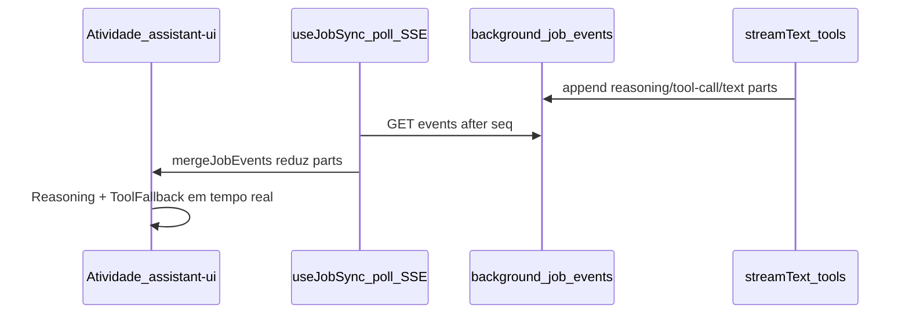

# Ingest agente: thread rica com reasoning, tools e stream parts

> Convenções compartilhadas: `docs/context/CONVENTIONS.md`. Pipeline de ingest e schema de questões:
> SPEC-0004. Monitor de job e thread assistant-ui: SPEC-0018. Eventos granulares e tab Atividade:
> SPEC-0019. AI SDK e providers: ADR-0007. Protocolo de mensagens em jobs: ADR-0008. Orquestração:
> ADR-0009.

## Objetivo

Substituir a extração bloqueante (`generateObject` one-shot) por um agente `streamText` com tools
reais na fase `extracting`, persistir parts do AI SDK v6 (reasoning, tool-call, text) em
`background_job_events`, e renderizar a tab **Atividade** com assistant-ui completo — reasoning
colapsável, tool calls agrupados e texto assistant — em tempo real via poll/SSE existente.

A tab **Progresso** permanece stepper + métricas (SPEC-0018); não duplica a thread.

## Fluxo



1. Consumer entra em `phase=extracting` e emite eventos system existentes (SPEC-0019 §Fase 2).
2. `runIngestAgent` invoca `streamText` com tools `submit_question` e `finish_extraction`;
   consome `fullStream` e persiste `IngestStreamPartEvent` em D1 (com throttle de reasoning).
3. Cada `submit_question` válido acumula questão em memória e emite `data-ingest-stream-progress`.
4. Ao encerrar o loop (tool `finish_extraction` ou `maxSteps`), o agente retorna array acumulado;
   fase `persisting` permanece inalterada (SPEC-0004).
5. Client (`ingest-event-mapper`) reduz stream parts em `ThreadMessageLike` com `content` rico
   (parts[]).
6. Tab **Atividade** renderiza `GroupedParts` + `Reasoning` + `ToolFallback` (assistant-ui).

## Contrato

### Agente — fase `extracting` (congelado)

Substituir caminho primário de `extract-questions.ts`: delegar para `runIngestAgent`; manter
`generateObject` exportado como fallback (ver §Fallback).

| Parâmetro | Valor |
| --------- | ----- |
| API | `streamText` (Vercel AI SDK v6) |
| `maxSteps` | **50** |
| `stopWhen` | `stepCountIs(50)` **e** encerramento quando tool `finish_extraction` for chamada |
| `abortSignal` | wired quando flag de cancel detectada entre chunks do `fullStream` |
| System prompt | atualizado em `constants.ts` — instruir uso **sequencial** das tools (não JSON solto) |

Módulos previstos (implementação futura):

| Módulo | Path | Responsabilidade |
| ------ | ---- | ---------------- |
| Tools | `src/features/ai/jobs/ingest/run-ingest/ingest-agent-tools.ts` | Zod + `tool()` AI SDK |
| Serializers | `src/features/ai/jobs/ingest/run-ingest/ingest-stream-parts.ts` | builders dos payloads |
| Loop | `src/features/ai/jobs/ingest/run-ingest/run-ingest-agent.ts` | `streamText` + `fullStream` |

---

### Tools do agente (congelado)

| Tool | Args | Efeito |
| ---- | ---- | ------ |
| `submit_question` | `ExtractedQuestion` (schema Zod existente em `extracted-question.ts`) | Valida via `parseExtractedQuestion`; acumula em memória; emite `data-ingest-stream-progress`; retorna `{ ok: true, index: number }` ou `{ ok: false, reason: string }` |
| `finish_extraction` | `{ total: number }` | Encerra loop do agente; retorna confirmação |

- `ExtractedQuestion`: mesmo contrato de `extractedQuestionSchema` (SPEC-0004) — **não** redefinir
  campos aqui.
- Após loop: retorna array acumulado para `persistQuestions` — contrato externo do orchestrator
  inalterado (`unknown[]`).

---

### Payloads de evento — `IngestStreamPartEvent` (congelado)

Novos tipos em `background_job_events.payload` (JSON), **além** dos `data-ingest-*` e text system
existentes (SPEC-0018, SPEC-0019):

```ts
type IngestStreamPartEvent =
  | { type: "reasoning-delta"; messageId: string; delta: string }
  | { type: "reasoning"; messageId: string; text: string }
  | { type: "tool-call"; messageId: string; toolCallId: string; toolName: string; argsText: string; state: "running" }
  | { type: "tool-result"; messageId: string; toolCallId: string; result: unknown; isError?: boolean }
  | { type: "text"; messageId: string; text: string };
```

| Campo / regra | Semântica |
| ------------- | --------- |
| `reasoning-delta` | fragmento incremental de chain-of-thought |
| `reasoning` | texto completo emitido no `reasoning-end` (flush) |
| `tool-call` | invocação iniciada; `state` sempre `"running"` na emissão |
| `tool-result` | resultado da tool; client faz merge com `tool-call` por `toolCallId` |
| `text` | texto assistant opcional (não confundir com mensagens system) |
| `messageId` | estável por step do agente: `ingest-step-<n>` (`n` ≥ 1, sequencial) |

#### Throttle de `reasoning-delta` (congelado)

- Append no D1 a cada **300 ms** **ou** no `reasoning-end` — o que ocorrer primeiro.
- Objetivo: evitar storm de rows em modelos com reasoning verboso.
- No `reasoning-end`: emitir evento `reasoning` com texto acumulado (flush final).

#### Mensagens system (inalteradas)

Mensagens de fase continuam `{ type: "text", text: string }` **sem** `messageId` — comportamento
SPEC-0018 / SPEC-0019 §Fase 2 inalterado.

#### Parts existentes (inalterados)

| Part | Uso |
| ---- | --- |
| `data-ingest-phase` | mudança de fase |
| `data-ingest-stream-progress` | progresso parcial (`{ count: number }` ou equivalente atual) |
| `data-ingest-persist-progress` | persistência incremental |
| `data-ingest-skipped-duplicate` | skip na persistência |
| `data-ingest-summary` | resumo final |

---

### Fallback `generateObject` (congelado)

| QUANDO | DEVE |
| ------ | ---- |
| `streamText` falha com erro de tool-calling não suportado pelo modelo | **1 retry** com `generateObject` (comportamento atual de `extract-questions.ts`) |
| fallback ativo | **sem** parts ricos (`IngestStreamPartEvent`); UI mostra apenas eventos textuais / data parts existentes |
| job concluído (agent ou fallback) | registrar em metadata do job `extractionMode: "agent" \| "fallback"` |

Erros de validação de questão individual **não** disparam fallback — retorno `{ ok: false, reason }`
da tool `submit_question`.

---

### Client — reducer de parts (congelado)

Refatorar `ingest-event-mapper.ts`:

```ts
type MappedThreadMessage = {
  id: string;
  role: "system" | "assistant";
  content: ThreadMessageLike["content"]; // string | parts[]
  seq: number;
  status?: "running" | "complete";
};
```

Função `mergeStreamParts(state, event)`:

| Evento | Redução |
| ------ | ------- |
| `reasoning-delta` | append no part `reasoning` do `messageId` |
| `reasoning` | substituir / consolidar part `reasoning` do `messageId` |
| `tool-call` | criar part `tool-call` (`running`) |
| `tool-result` | merge no part `tool-call` matching `toolCallId` (args + result + status) |
| `text` (+ `messageId`) | part `text` na mensagem assistant |
| job terminal | marcar `status: "complete"` na última mensagem assistant |

- Estado interno: `Map<messageId, parts[]>` para mensagens assistant em construção.
- Mensagens `system` (bubbles centrais): continuam `content: string`.

Badges na tab **Eventos** (`ingest-event-labels.ts`): `Raciocínio`, `Tool`, `Texto` para os novos
tipos.

---

### UI — tab Atividade (congelado)

| Peça | Comportamento |
| ---- | ------------- |
| `ingest-job-thread.tsx` | `convertMessage` passa `content` como array de parts (não só `{ type: "text" }`) |
| `ingest-thread.tsx` | `IngestAssistantMessage` usa `MessagePrimitive.GroupedParts` com mesmos `groupBy` de `thread.tsx` (`Reasoning`, `ToolFallback`, texto) |
| job em execução | última mensagem assistant: `ReasoningRoot streaming={true}`; tools com status `running` |

Resultado visual esperado durante extração:

```text
[system bubble] Extraindo questões com o modelo de IA…
[assistant]
  ▸ Pensou por 3s          ← Reasoning collapsible
  ▸ Used tool: submit_question (3)   ← ToolGroup
  "Identifiquei 3 questões até agora…"
```

## Casos de borda

| # | QUANDO | o sistema DEVE |
| --- | ------ | -------------- |
| 1 | modelo sem suporte a tool-calling | fallback `generateObject`; `extractionMode: "fallback"`; UI degradada (sem reasoning/tools) |
| 2 | reasoning verboso do modelo | throttle 300 ms server-side; flush no `reasoning-end` |
| 3 | agente atinge 50 steps sem `finish_extraction` | encerrar por `stopWhen`; persistir questões acumuladas até então |
| 4 | `submit_question` com payload inválido | retornar `{ ok: false, reason }`; **não** abortar agente |
| 5 | cancel solicitado durante `fullStream` | respeitar `abortSignal`; questões já acumuladas seguem para persistência se loop encerrar normalmente antes do abort (SPEC-0004 §Cancelamento) |
| 6 | `tool-call` sem `tool-result` ainda | UI mostra tool em status `running` |
| 7 | múltiplos `reasoning-delta` no mesmo `messageId` | client concatena no part `reasoning` |
| 8 | evento `text` com `messageId` vs system sem `messageId` | mapper roteia: com `messageId` → assistant parts; sem → bubble system |
| 9 | poll/SSE reidrata após refresh | reducer idempotente por `seq`; parts reconstruídos na ordem |
| 10 | prova grande (~100 questões) | `maxSteps=50` + `finish_extraction` obrigatório no prompt; margem para retries de tool |

## Questões em aberto

- [ ]

## Definition of Done

```bash
npm run typecheck                 # exit 0
npm test -- --run src/features/ai/jobs/ingest src/features/background-processes
npm run docs-check                # exit 0
```

Critérios funcionais:

- Fase `extracting` usa `streamText` + tools como caminho primário
- Eventos `IngestStreamPartEvent` persistidos com throttle de reasoning
- Tab **Atividade** exibe reasoning colapsável e tool calls durante extração
- Fallback `generateObject` funcional com `extractionMode` em metadata
- Addendum em `docs/specs/exams/0004-pipeline-ingestao.md` §LLM documenta caminho agente
- Testes cobrem mock de `fullStream` (reasoning + tool-call + `submit_question`)

## Revisão humana

- Extração longa (30+ questões): thread legível, sem flicker excessivo
- Fallback com modelo sem tools: degradación graciosa, job completa
- Reasoning collapsible e tool groups alinhados visualmente ao chat principal (`thread.tsx`)

## Verificação

```bash
npm run typecheck                          # exit 0
npm test -- --run src/features/ai/jobs/ingest src/features/background-processes  # 17 passed
npm run docs-check                         # exit 0
```

Verificado em 22/06/2026 — paridade com DoD funcional:
- `extract-questions.ts` delega para `runIngestAgent` com `streamText` + `submit_question`/`finish_extraction`
- `IngestStreamPartEvent` persistidos com throttle reasoning 300ms (`ingest-stream-parts.ts`)
- Tab Atividade renderiza `Reasoning` + `ToolFallback` em tempo real (`ingest-thread.tsx`)
- Fallback `generateObject` com `extractionMode` em metadata do job
- Addendum em `docs/specs/exams/0004-pipeline-ingestao.md` §LLM
- Testes com mock `fullStream`: reasoning + tool-call + `submit_question` + `finish_extraction`

## Fora de escopo (v1)

- Mover feed de atividade para tab **Progresso** (direita)
- Tools na fase `persisting` (batch insert permanece)
- Chat `/api/chat` (SPEC-0012)
- Durable Object / WebSocket (ADR-0008)
- PDF ingest (ADR-0002)
